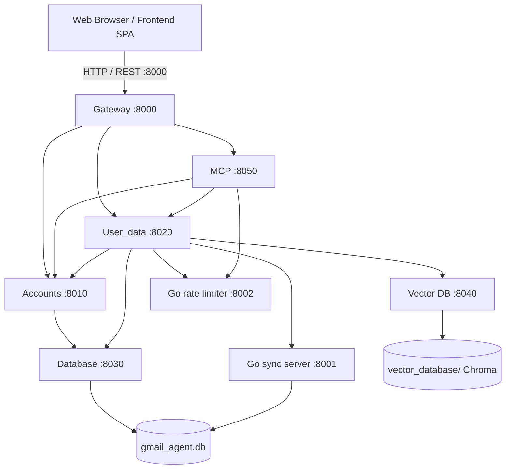

# Mail Agent 📬🤖

> **Status Notice:**
> 1. **MCP Server Note:** The MCP server component is currently undergoing maintenance/refactoring due to recent schema changes (known issue).
> 2. **Project Status (Work in Progress):** This project is actively being developed. Tasks remaining on the roadmap include field-level encryption, enhanced AI guardrails, and additional email provider integrations.
> 3. **Public Availability:** Published to showcase architecture and design patterns.

---

An AI-powered Gmail and Google Calendar intelligent assistant that caches emails locally, generates semantic vector embeddings for natural language search, integrates with Google Calendar and Moodle, and provides agentic LLM tools.

Mail Agent leverages a **hybrid Python–Go microservice architecture**. The Python backend is split into six independently-runnable FastAPI services, each the sole owner of exactly one resource:
- **Gateway (`:8000`):** the only public entry point — CORS, `/static` + `/templates` mounts, the landing page, and a reverse proxy that forwards each public route to its owning service. No business logic, no rate-limit checks.
- **Accounts (`:8010`):** sole credential authority — the `accounts`, `email_accounts` and `email_tokens` domain, plus every OAuth flow.
- **User_data (`:8020`):** the `emails` domain, the Gmail and Google Calendar clients, Moodle, mail cleaning, and the embedding trigger.
- **Database (`:8030`):** sole Python owner of `gmail_agent.db` — SQLAlchemy models + `DatabaseManager`.
- **Vector DB (`:8040`):** sole owner of the Chroma `vector_database/` directory and the `mxbai-embed-large` embedding model.
- **MCP (`:8050` + stdio):** 14 tools, 9 resources, LLM/Ollama orchestration, and the `/api/query` + `/api/llm-query` endpoints.

Around them sit the components that are not part of the Python split:
- **Go Email Sync Service:** a dedicated high-throughput microservice handling concurrent email fetching, header/body parsing, database caching, and batch vector embedding generation.
- **Go Rate Limiter Service:** a standalone token-bucket rate limiter microservice providing flexible rate limiting across endpoints.
- **ChromaDB & Ollama:** local semantic vector storage and embedding generation (`mxbai-embed-large`) paired with local SLMs (`mistral`) or cloud LLMs (`gpt-4o-mini`).

---

## 📌 Rate Limiter Microservice (Standalone Component)

> [!NOTE]
> **Important Note Regarding Rate Limiter:**
> The `ratelimiter/` folder is a **separate, standalone project** created by the author. It is designed as a reusable, plug-and-play Go microservice that can be integrated into any existing REST API (Python/FastAPI, Flask, Node.js/Express, Go, etc.) using the Token Bucket algorithm. It is included here as a core integration but is decoupled from Mail Agent domain logic.

---

## 🏛️ System Architecture



The graph is **acyclic**. Startup order follows it: `Database` → `Accounts` + `Vector DB` → `User_data` → `MCP` → `Gateway`.

Ownership rules that the architecture depends on:
- Only the **Database** service touches `gmail_agent.db` from Python; only **Accounts** touches `email_tokens`, `credentials.json` or runs OAuth; only **User_data** calls the Gmail API, the Google Calendar API or the Go sync server; only **Vector DB** opens Chroma or the embedding model; only **MCP** calls OpenAI or Ollama chat.
- Only the Gateway binds `0.0.0.0`. The five backend services bind `127.0.0.1`, and their `/internal/*` routes are **never** routed through the Gateway.
- Rate-limit checks live in the service that owns the endpoint, never in the Gateway.

---

## 🛠️ Tech Stack & Dependencies

| Layer | Technologies / Libraries | Purpose |
|---|---|---|
| **Core Backend** | Python 3.10+, FastAPI, Uvicorn, Pydantic | REST API, OAuth flow coordination, static web serving |
| **Go Sync Microservice** | Go 1.20+, `google.golang.org/api/gmail/v1`, `modernc.org/sqlite` | High-concurrency email fetching, parsing, and batch embedding |
| **Rate Limiting** | Go (Token Bucket), Python Client Wrapper | Endpoint and server-wide rate limiting |
| **Primary Database** | SQLite, SQLAlchemy 2.0 | Multi-user accounts, connected email accounts, tokens, email cache |
| **Vector Database** | ChromaDB, LangChain (`langchain-chroma`, `langchain-ollama`) | Semantic email embeddings and vector similarity search |
| **AI & LLM** | Ollama (`mxbai-embed-large`, `mistral`), OpenAI (`gpt-4o-mini`), FastMCP | Semantic embeddings, question answering, agentic tool calling |
| **External APIs** | Google Gmail API, Google Calendar API | Email retrieval and calendar event management |
| **Frontend** | Vanilla HTML5, CSS3 (Modern Glassmorphic UI), JavaScript | Landing page, multi-account dashboard, calendar UI, AI assistant |
| **Testing** | Pytest, `pytest-asyncio`, `httpx` | Integration and unit testing suite |

---

## 🌐 Network Ports & Service Overview

| Service | Port | Description | Required / Optional |
|---|---|---|---|
| **Gateway (Python/FastAPI)** | `8000` | Public entry point, web UI, reverse proxy (`http://localhost:8000`) | **Required** |
| **Accounts (Python/FastAPI)** | `8010` | Accounts, mailboxes, tokens, all OAuth — sole credential authority | **Required** |
| **User_data (Python/FastAPI)** | `8020` | Emails, Gmail + Google Calendar clients, Moodle, embedding trigger | **Required** |
| **Database (Python/FastAPI)** | `8030` | Sole Python owner of `gmail_agent.db` | **Required** |
| **Vector DB (Python/FastAPI)** | `8040` | Sole owner of the Chroma store + `mxbai-embed-large` | **Required** |
| **MCP (Python/FastMCP)** | `8050` + stdio | 14 MCP tools, 9 resources, `/api/query`, `/api/llm-query` | **Required** for AI endpoints |
| **Go Email Sync Server** | `8001` | High-speed concurrent email ingestion | **Optional** (Python fallback exists) |
| **Go Rate Limiter Service** | `8002` | Token-bucket rate limiting server | **Optional** (fails open gracefully) |
| **Ollama Local AI Server** | `11434` | Vector embeddings and local SLM inference (`http://127.0.0.1:11434`) | **Required for local AI / embeddings** |
| Google OAuth loopback | `8080` | `InstalledAppFlow.run_local_server` redirect listener for CLI / interactive OAuth | **For OAuth authorization** |

The web OAuth callback (`http://localhost:8000/oauth/callback`) is served by the Gateway on `8000` and proxied to Accounts. Only `8000` is externally reachable; `8010`–`8050` are loopback-only.

---

## 📁 Codebase Structure

```text
Mail-Agent/
├── backend/
│   ├── gateway/                    # :8000 — public entry point
│   │   ├── app.py                  # CORS, /static + /templates mounts, "/", proxy route registration
│   │   └── proxy.py                # generic reverse proxy + per-route timeout table
│   ├── services/
│   │   ├── database/               # :8030 — sole Python owner of gmail_agent.db
│   │   │   ├── app.py  config.py
│   │   │   ├── models.py           # SQLAlchemy Base + Account, EmailAccount, EmailToken, Email
│   │   │   ├── manager.py          # DatabaseManager
│   │   │   └── routers/            # accounts.py email_accounts.py email_tokens.py emails.py stats.py
│   │   ├── accounts/               # :8010 — sole credential authority
│   │   │   ├── app.py  config.py  clients.py
│   │   │   ├── google_oauth.py     # SCOPES, web + CLI OAuth flows, re-auth helpers
│   │   │   ├── credentials.py      # resolve_valid_credentials() — the refresh/scope/reauth ladder
│   │   │   ├── routers/            # registration.py oauth.py email_accounts.py internal.py
│   │   │   └── cli/                # add_user.py list_users.py reauth_user.py
│   │   ├── user_data/              # :8020 — emails, Google clients, Moodle
│   │   │   ├── app.py  config.py  clients.py
│   │   │   ├── gmail.py            # Gmail API client, message listing, body extraction
│   │   │   ├── google_calendar.py  # Google Calendar service initialization
│   │   │   ├── moodle.py           # Moodle calendar parsing via Google Calendar subscriptions
│   │   │   ├── clean_mails.py      # HTML-to-text, footer/signature stripping
│   │   │   ├── sync.py             # Go sync path + Python fallback pipeline
│   │   │   ├── routers/            # emails.py calendar.py internal_emails.py internal_calendar.py
│   │   │   └── cli/                # delete_calendar_events.py
│   │   ├── vector_db/              # :8040 — sole owner of the Chroma store
│   │   │   ├── app.py  config.py
│   │   │   ├── store.py            # embed_and_store, store_in_vector_db, query_vector_db
│   │   │   └── routers/vectors.py
│   │   └── mcp/                    # :8050 + stdio
│   │       ├── config.py  clients.py
│   │       ├── ask_ollama.py       # streaming client for local Ollama chat models
│   │       ├── llm_integration.py  # TOOL_REGISTRY, TOOLS_MANIFEST, OpenAI/Ollama tool loops
│   │       ├── tools/              # accounts.py emails.py calendar.py ai.py
│   │       ├── resources.py        # the 9 MCP resources
│   │       ├── mcp_server.py       # FastMCP registration + mcp.run()   [stdio entrypoint]
│   │       └── http_app.py         # /api/query, /api/llm-query          [:8050]
│   ├── libs/
│   │   ├── common/                 # config.py http.py errors.py data_recorder.py
│   │   └── contracts/              # accounts.py emails.py vectors.py stats.py — shared DTOs
│   └── go-server/                  # High-performance Go email synchronization microservice
│       ├── main.go                 # HTTP handler (:8001) and concurrent worker pool (fetchWorker)
│       ├── auth.go                 # Google OAuth token management and auto-refresh in Go
│       ├── chroma.go               # Batch embedding client communicating with Ollama (:11434)
│       ├── database.go             # Direct SQLite insertion for fetched emails
│       └── date.go                 # RFC 2822 email date parser
├── ratelimiter/                    # Reusable Token Bucket Rate Limiter (Separate Project)
│   ├── main.go                     # Rate limiter microservice entrypoint (:8002)
│   ├── limiter.go                  # Token bucket state management and thread-safe mutex logic
│   ├── bucket.go                   # Bucket refill mathematical calculation
│   ├── handlers.go                 # HTTP endpoints (/check, /status, /health, /reset)
│   ├── models.go                   # Rate limiting request/response schemas
│   ├── client/
│   │   └── ratelimiter_client.py   # Python HTTP client with fail-open fallback
│   ├── USAGE_GUIDE.md              # Standalone integration guide for any REST API
│   └── README.md                   # Detailed documentation for the rate limiter
├── frontend/
│   ├── landing.html                # User authentication & landing page UI
│   ├── templates/
│   │   └── main.html               # Main dashboard SPA (Emails, Calendar, AI Assistant)
│   └── static/
│       ├── landing.css             # Landing page stylesheet
│       ├── landing.js              # Landing page authentication logic
│       └── styles.css              # Main dashboard styles
├── scripts/
│   └── run_all.sh                  # Start/stop all six Python services in dependency order
├── tests/
│   ├── conftest.py                 # In-process ASGI wiring + shared fixtures
│   ├── unit/                       # Per-service unit tests (no I/O)
│   ├── contract/                   # Service-boundary contract tests (in-process ASGI)
│   ├── golden/                     # 28 captured responses replayed through the Gateway
│   └── e2e/                        # test_endpoints_integration.py, test_rate_limiter.py
├── pyproject.toml                  # Project metadata & dependencies (uv)
├── uv.lock                         # Locked, reproducible dependency versions
├── pytest.ini                      # Test runner configuration + unit/contract/golden/e2e markers
└── README.md                       # Project documentation
```

---

## 🗄️ Database Architecture

The application implements a multi-tenant relational schema using SQLAlchemy with SQLite:

```
[Account] (id, primary_email, password_hash, created_at)
   │
   └── 1:N ──> [EmailAccount] (id, account_id, email, provider, is_primary)
                   │
                   ├── 1:1 ──> [EmailToken] (id, email_account_id, access_token, refresh_token, scopes, expiry)
                   │
                   └── 1:N ──> [Email] (id, email_account_id, message_id, thread_id, subject, sender, recipient, date_sent, snippet, body_text, body_html)
```

- **Account:** Represents the registered user who signs into the web application.
- **EmailAccount:** A connected email provider account (supports multiple Gmail accounts per user).
- **EmailToken:** Centralized database storage for OAuth2 access/refresh tokens with automatic token rotation.
- **Email:** Cached email metadata and cleaned bodies to enable offline viewing and avoid redundant Gmail API quota consumption.
- **ChromaDB Collection (`mails`):** Persists 1024-dimensional embeddings of cleaned email text indexed by `message_id` with metadata for semantic retrieval.

---

## 🚀 Getting Started & Prerequisites

### 1. System Requirements
- **Python:** `3.10` or higher
- **Go:** `1.20` or higher (for the email sync and rate limiter microservices)
- **Ollama:** Installed from [ollama.ai](https://ollama.ai) (for local embeddings and SLM)
- **Google Cloud Console Credentials:**
  - Create a project in Google Cloud Console.
  - Enable **Gmail API** and **Google Calendar API**.
  - Create an **OAuth 2.0 Client ID** (Application type: *Web Application*).
  - Add Authorized Redirect URIs:
    - `http://localhost:8080/`
    - `http://localhost:8000/oauth/callback`
  - Download the client configuration file and save it as `credentials.json` in the root directory.

### 2. Environment Configuration
Create a `.env` file in the project root directory:

```env
# Optional: OpenAI API key for MCP agent and fallback LLM queries
OPENAI_API_KEY=your_openai_api_key_here

# Ollama local server address (default is http://127.0.0.1:11434)
OLLAMA_BASE_URL=http://127.0.0.1:11434
```

### 3. Installation
This project uses [**uv**](https://docs.astral.sh/uv/) as its package manager. Install uv once (macOS/Linux):

```bash
curl -LsSf https://astral.sh/uv/install.sh | sh
```

or

```bash
brew install uv
```

Then sync the project's virtual environment and dependencies (`uv` reads `.python-version`, installs Python 3.12 if needed, and creates `.venv` automatically):

```bash
uv sync
```

No manual `venv create` / `activate` / `pip install` steps are required. Run any command inside the environment with `uv run <cmd>`, or activate it directly with `source .venv/bin/activate` if you prefer.

### 4. Setup Ollama Models
Ensure Ollama is running and download the embedding and chat models:

```bash
# Start Ollama service
ollama serve

# Pull embedding model (required for vector database)
ollama pull mxbai-embed-large

# Optional: Pull local SLM for chat/querying
ollama pull mistral:latest
```

---

## 🏃 How to Run the Services

### Option 1: `scripts/run_all.sh` (recommended)

```bash
bash scripts/run_all.sh            # start all six Python services in dependency order
bash scripts/run_all.sh --stop     # tear everything back down
```

The script launches each stage, waits for every service in that stage to answer `GET /health`, and only then starts the next stage. A service that fails to come up is fatal. Pid files and per-service logs land in `.run/`.

> [!NOTE]
> The Go sync server (`:8001`), the Go rate limiter (`:8002`) and Ollama (`:11434`) are **managed separately** — `run_all.sh` neither starts nor stops them.

Open **http://localhost:8000** in your browser.

---

### Option 2: Manual start, in dependency order

One terminal tab per service. The order is not optional — each service resolves its upstreams at request time and the Gateway is started last:

```bash
# 1. Database (:8030) — sole owner of gmail_agent.db
uv run python -m backend.services.database.app

# 2. Accounts (:8010) and Vector DB (:8040) — these two may start in parallel
uv run python -m backend.services.accounts.app
uv run python -m backend.services.vector_db.app

# 3. User_data (:8020)
uv run python -m backend.services.user_data.app

# 4. MCP HTTP app (:8050)
uv run python -m backend.services.mcp.http_app

# 5. Gateway (:8000) — the only public listener
uv run uvicorn backend.gateway.app:app --reload --host 0.0.0.0 --port 8000
```

The Go services and Ollama are started on their own, independently of the Python stack:

```bash
cd ratelimiter && go run .          # rate limiter, :8002
cd backend/go-server && go run .    # email sync, :8001
ollama serve                        # embeddings + local SLM, :11434
```

---

### Option 3: Python services only (no Go, no Ollama)

The six Python services run fine on their own:
- **Email Sync:** User_data detects that port `8001` is unavailable and falls back to its internal Python Gmail sync pipeline.
- **Rate Limiting:** the Python rate-limiter client fails open gracefully, so requests proceed without disruption.
- **Embeddings / local chat:** these need Ollama on `11434`; without it, semantic search and the local SLM path are unavailable.

---

### Option 4: Running the FastMCP server (standalone stdio)

The MCP service has two entrypoints over one codebase: the HTTP app on `:8050` (Option 1/2 above) and the stdio server for external agent tooling:

```bash
# Standalone execution
uv run python -m backend.services.mcp.mcp_server

# Or inspect with MCP Inspector
npx @modelcontextprotocol/inspector uv run python -m backend.services.mcp.mcp_server
```

---

## 🔌 API Endpoints Summary

### Authentication & Account Management
- `POST /api/auth/signup`: Create a new user account with hashed credentials.
- `POST /api/auth/signin`: Authenticate existing account.
- `GET /api/users`: Fetch connected email accounts for the current user.
- `POST /api/users`: Link a new email account to a user.
- `GET /api/auth/google`: Initiate Google OAuth flow.
- `GET /oauth/callback`: Google OAuth callback receiver.

### Email Operations
- `GET /api/emails`: Retrieve paginated/cached emails for a specific account.
- `GET /api/sync`: Trigger incremental email synchronization (routes through Go microservice on port 8001 with Python fallback; rate limited via port 8002).
- `GET /api/query`: Semantic natural language query over embedded emails using ChromaDB.

### Calendar Operations
- `GET /api/calendar/events`: Retrieve combined Google Calendar and Moodle events.
- `POST /api/calendar/events`: Create a new calendar event.
- `PUT /api/calendar/events/{event_id}`: Update an existing event.
- `DELETE /api/calendar/events/{event_id}`: Delete an event.
- `GET /api/calendar/moodle`: Fetch events from subscribed Moodle calendar.
- `GET /api/calendar/status`: Check Google Calendar connection status.

### AI & Agent Integration
- `POST /api/llm-query`: Process natural language agent queries with iterative MCP tool execution (e.g., *"Find all deadlines in my unread emails and add them to my calendar"*).

---

## 🤖 MCP Tool Capabilities

`backend/services/mcp/` exposes 14 function tools and 9 resources conforming to the Model Context Protocol:

| Tool Name | Parameters | Description |
|---|---|---|
| `list_accounts` | `None` | Lists all registered user accounts |
| `list_email_accounts` | `account_id?` | Lists connected Gmail/Outlook accounts |
| `get_account_info` | `account_id` | Returns account metadata and its mailboxes |
| `get_email_account_info` | `email_account_id` | Returns metadata and total email counts |
| `search_emails` | `query, email_account_id?, use_semantic?, limit?` | Executes Gmail query search or vector semantic search |
| `sync_emails` | `email_account_id, max_results?` | Triggers sync and vector embedding |
| `get_email_details` | `message_id` | Fetches full headers, text, and HTML body |
| `get_email_account_emails` | `email_account_id, limit?` | Lists cached emails for a mailbox |
| `create_calendar_event` | `title, date, time?, description?, category?` | Creates a new Google Calendar entry |
| `update_calendar_event` | `event_id, title?, date?, time?, description?, category?` | Modifies an existing calendar entry |
| `delete_calendar_event` | `event_id` | Deletes a calendar event |
| `get_calendar_events` | `start_date?, end_date?` | Retrieves merged Primary and Moodle calendar events |
| `extract_dates_from_emails`| `email_account_id, limit?, auto_create_events?` | Extracts deadlines via LLM and optionally books events |
| `summarize_emails` | `query?, email_account_id?, summary_type?` | Generates brief or bulleted summaries of matching emails |

---

## ⚡ CLI Utilities

Operator CLIs live inside the service that owns their domain and are run as modules from the repo root:

```bash
# Add a new Gmail account via CLI OAuth flow
uv run python -m backend.services.accounts.cli.add_user

# List all accounts and linked emails in the database
uv run python -m backend.services.accounts.cli.list_users

# Re-authenticate an email account whose tokens expired or failed
uv run python -m backend.services.accounts.cli.reauth_user

# Delete all events in a specified date range
uv run python -m backend.services.user_data.cli.delete_calendar_events
```

> [!NOTE]
> The Accounts CLIs talk to the Database service over HTTP, so **Database (`:8030`) and Accounts (`:8010`) must be running** before you invoke them. `delete_calendar_events` likewise needs User_data (`:8020`) and its upstreams.

---

## 🧪 Testing

The suite is split into four groups, registered as pytest markers in `pytest.ini`:

| Group | Path | What it covers | Needs live processes? |
|---|---|---|---|
| `unit` | `tests/unit/` | Per-service logic in isolation | No |
| `contract` | `tests/contract/` | Service-boundary request/response shapes | No |
| `golden` | `tests/golden/` | 28 captured public responses replayed through the Gateway | No |
| `e2e` | `tests/e2e/` | `test_endpoints_integration.py` (in-process) and `test_rate_limiter.py` | Only `test_rate_limiter.py` |

```bash
# Everything that runs in-process with no network at all
uv run pytest tests/unit tests/contract tests/golden -q

# Or by marker
uv run pytest -m "not e2e"

# Live-process suite: needs all six services plus the Go rate limiter on :8002
uv run pytest tests/e2e/test_rate_limiter.py
```

Except for `tests/e2e/test_rate_limiter.py`, the whole suite is wired **in-process** over `httpx.ASGITransport`: the service apps are mounted directly into each other via FastAPI dependency overrides, the database points at a throwaway temp file, and Google, OpenAI, Ollama, Chroma, the Go sync server and the rate limiter are all mocked. No sockets are opened, no ports need to be up, and nothing reaches the real `gmail_agent.db`, the real Chroma store, or any external API.

`tests/golden` is the arbiter of behavioral correctness: 27 of its 28 responses are byte-identical to the pre-refactor monolith, and one was deliberately re-baselined for the `/api/llm-query` `TypeError` fix.

> [!TIP]
> If testing rate-limited endpoints, you can reset the rate limiter state using `curl -X POST http://localhost:8002/reset` before running tests to prevent rate limit assertions from failing due to consumed tokens.

> [!NOTE]
> Two tests in `tests/e2e/test_endpoints_integration.py` (`test_create_calendar_event_missing_email_account_id`, `test_update_calendar_event_success`) are **known-red and pre-date the refactor**: they send request bodies that fail the endpoints' Pydantic validation and so get `422`. They are test bugs, not product regressions, and are carried across unchanged.

---

## ⚠️ Known constraints

Things a new contributor will trip over. None of these are accidents of the refactor — they are documented, deliberate, and (where relevant) tracked separately.

### The Go sync server writes straight to the SQLite file

The Database service is the sole **Python** owner of `gmail_agent.db`, but the Go sync server on `:8001` opens the same file directly: it `INSERT`s into `emails` and `SELECT`s `email_tokens` itself. This is a documented exception to single-writer ownership. It also makes `backend/go-server/` immovable — its `DBPath` is the relative path `../../gmail_agent.db`, so relocating the directory silently breaks it. The refactor reduced Python writers from three processes (web app, MCP server, CLIs) to one, but the Go writer remains.

### Interactive OAuth runs inside a web request

When a mailbox's token cannot be refreshed, the credential ladder falls through to `InstalledAppFlow.run_local_server(port=8080)` — an **interactive browser flow, started on the server, inside an HTTP request**. It waits for a human to click through Google's consent screen on the machine running Accounts. While it waits it occupies an Accounts worker, so a hung re-auth degrades sign-in for everyone. The flow is wrapped in `run_in_threadpool` so it no longer blocks the event loop, and the Gateway allows a 120 s timeout on Accounts routes, but the fundamental shape is unchanged from before the refactor.

### Preserved defects (X1–X10)

The refactor was behavior-preserving, which means it preserved the bugs too. These were all identified, deliberately **not** fixed, and reproduced verbatim so the golden suite stays green:

| # | Issue |
|---|---|
| **X1** | 🔴 **Sign-up is an account-takeover vector.** `POST /api/auth/signup` with an **email that already exists** and **any password whatsoever** returns `{"status": "success", "account_id": <the existing account's id>}`. The database is not modified, but the caller receives a working session for somebody else's tenant. This is a real, exploitable authentication bypass. It was deliberately left out of scope for the refactor — fixing it changes observable behavior, which this project was forbidden to do — and it is tracked as its own ticket. **Do not deploy this as-is.** |
| **X2** | `GET /api/users` with no `account_id` returns **every** email account across all tenants. |
| **X3** | `emails.message_id` has no unique constraint, yet email lookups use `filter_by(message_id=...).first()`. If two mailboxes cache the same message, an arbitrary row wins. |
| **X4** | Calendar access is hardwired to email account `1` in three places; `/api/calendar/status` and `/api/calendar/moodle` silently fall back to it. |
| **X5** | `thread_id` is never populated by either sync path but is still returned by the email-details response. Always `NULL`. |
| **X6** | The local SLM model string is `"qwen3.8:27b-mlx  "` — not a valid model name, and it has trailing whitespace. Moved into config but left verbatim. |
| **X7** | `data_recorder.py` existed twice (under `utilities/` and `data_utils/`), identical and imported by nothing. Consolidated to one copy in `backend/libs/common/` during the split; it is still imported by nothing. |
| **X8** | `/api/query` has its local-SLM (`slm_response`) path commented out in favour of the OpenAI `llm_response` path. |
| **X9** | The MCP `last_sync_time` context value is process-local, resets on restart, and is never updated by the public `GET /api/sync`. |
| **X10** | Blocking calls inside `async def` handlers: `requests.post` to the Go server, `googleapiclient` calls, and `limiter.check` all block the event loop. The split added synchronous `httpx` credential fetches — the same class of problem, no regression. |

### `new_emails` does not mean "newly saved"

`GET /api/sync` reports `new_emails` as the number of messages **fetched**, not the number newly written to the database. In the Go branch that happens to be the same number; in the Python fallback branch it is the full fetched list, so it diverges whenever a `message_id` repeats. This is pinned by two golden files and reproduced verbatim.

---

## ⚡ Quick Reference

| Action | Command |
|---|---|
| **Start all Python services** | `bash scripts/run_all.sh` |
| **Stop all Python services** | `bash scripts/run_all.sh --stop` |
| **Gateway only (public entry)** | `uv run uvicorn backend.gateway.app:app --reload --host 0.0.0.0 --port 8000` |
| **Go Sync Server** | `cd backend/go-server && go run .` |
| **Go Rate Limiter** | `cd ratelimiter && go run .` |
| **Ollama Service** | `ollama serve` |
| **Pull Embedding Model** | `ollama pull mxbai-embed-large` |
| **Add Gmail Account** | Web UI at `http://localhost:8000` or `uv run python -m backend.services.accounts.cli.add_user` |
| **MCP stdio server** | `uv run python -m backend.services.mcp.mcp_server` |
| **Run in-process test suite** | `uv run pytest tests/unit tests/contract tests/golden -q` |
