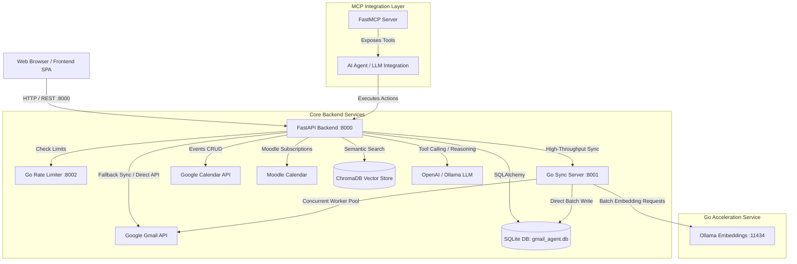

# Mail Agent 📬🤖

> **Status Notice:**
> 1. **MCP Server Note:** The MCP server component is currently undergoing maintenance/refactoring due to recent schema changes (known issue).
> 2. **Project Status (Work in Progress):** This project is actively being developed. Tasks remaining on the roadmap include field-level encryption, enhanced AI guardrails, and additional email provider integrations.
> 3. **Public Availability:** Published to showcase architecture and design patterns.

---

An AI-powered Gmail and Google Calendar intelligent assistant that caches emails locally, generates semantic vector embeddings for natural language search, integrates with Google Calendar and Moodle, and provides agentic LLM tools.

Mail Agent leverages a **hybrid Python–Go microservice architecture**:
- **FastAPI (Python):** Serves the main REST API, runs the single-page application (SPA) frontend, manages database transactions, and coordinates AI/LLM workflows.
- **Go Email Sync Service:** A dedicated high-throughput microservice handling concurrent email fetching, header/body parsing, database caching, and batch vector embedding generation.
- **Go Rate Limiter Service:** A standalone token-bucket rate limiter microservice providing flexible rate limiting across endpoints.
- **ChromaDB & Ollama:** Local semantic vector storage and embedding generation (`mxbai-embed-large`) paired with local SLMs (`mistral`) or cloud LLMs (`gpt-4o-mini`).

---

## 📌 Rate Limiter Microservice (Standalone Component)

> [!NOTE]
> **Important Note Regarding Rate Limiter:**
> The `ratelimiter/` folder is a **separate, standalone project** created by the author. It is designed as a reusable, plug-and-play Go microservice that can be integrated into any existing REST API (Python/FastAPI, Flask, Node.js/Express, Go, etc.) using the Token Bucket algorithm. It is included here as a core integration but is decoupled from Mail Agent domain logic.

---

## 🏛️ System Architecture



---

## 🛠️ Tech Stack & Dependencies

| Layer | Technologies / Libraries | Purpose |
|---|---|---|
| **Core Backend** | Python 3.10+, FastAPI, Uvicorn, Pydantic | REST API, OAuth flow coordination, static web serving |
| **Go Sync Microservice** | Go 1.20+, `google.golang.org/api/gmail/v1`, `modernc.org/sqlite` | High-concurrency email fetching, parsing, and batch embedding |
| **Rate Limiting** | Go (Token Bucket), Python Client Wrapper | Endpoint and server-wide rate limiting |
| **Primary Database** | SQLite, SQLAlchemy 2.0 | Multi-user accounts, connected email accounts, tokens, email cache |
| **Vector Database** | ChromaDB, LangChain (`langchain-chroma`, `langchain-ollama`) | Semantic email embeddings and vector similarity search |
| **AI & LLM** | Ollama (`mxbai-embed-large`, `mistral`), OpenAI (`gpt-4o-mini`), FastMCP | Semantic embeddings, question answering, agentic tool calling |
| **External APIs** | Google Gmail API, Google Calendar API | Email retrieval and calendar event management |
| **Frontend** | Vanilla HTML5, CSS3 (Modern Glassmorphic UI), JavaScript | Landing page, multi-account dashboard, calendar UI, AI assistant |
| **Testing** | Pytest, `pytest-asyncio`, `httpx` | Integration and unit testing suite |

---

## 🌐 Network Ports & Service Overview

| Service | Port | Description | Required / Optional |
|---|---|---|---|
| **Python FastAPI & Web UI** | `8000` | Main application server and UI (`http://localhost:8000`) | **Required** |
| **Go Email Sync Server** | `8001` | High-speed concurrent email ingestion (`http://localhost:8001`) | **Optional** (Python fallback exists) |
| **Go Rate Limiter Service** | `8002` | Token-bucket rate limiting server (`http://localhost:8002`) | **Optional** (Fails open gracefully) |
| **Ollama Local AI Server** | `11434` | Vector embeddings and local SLM inference (`http://127.0.0.1:11434`) | **Required for local AI / embeddings** |
| **Google OAuth Redirect 1** | `8080` | Local redirect listener for CLI / standalone OAuth (`http://localhost:8080/`) | **For OAuth authorization** |
| **Google OAuth Callback 2** | `8000` | Web OAuth callback endpoint (`http://localhost:8000/oauth/callback`) | **For Web OAuth flow** |

---

## 📁 Codebase Structure

```text
Mail-Agent/
├── backend/
│   ├── app.py                      # FastAPI application, route handlers, CORS, and static file mounts
│   ├── databases/
│   │   ├── database.py             # SQLAlchemy models (Account, EmailAccount, EmailToken, Email) & DatabaseManager
│   │   └── vector_database.py      # ChromaDB setup, embedding persistence, and LangChain vector search
│   ├── go-server/                  # High-performance Go email synchronization microservice
│   │   ├── main.go                 # HTTP handler (:8001) and concurrent worker pool (fetchWorker)
│   │   ├── auth.go                 # Google OAuth token management and auto-refresh in Go
│   │   ├── chroma.go               # Batch embedding client communicating with Ollama (:11434)
│   │   ├── database.go             # Direct SQLite insertion for fetched emails
│   │   └── date.go                 # RFC 2822 email date parser
│   ├── services/
│   │   ├── gmail_read.py           # Gmail API client, message listing, body extraction, OAuth setup
│   │   ├── setup_calendar.py       # Google Calendar API authentication and service initialization
│   │   └── moodle_calendar.py      # Moodle calendar parsing via Google Calendar subscriptions
│   ├── mcp_server.py               # Model Context Protocol (FastMCP) server exposing tools to LLMs
│   ├── llm_integration.py          # OpenAI Function Calling & Ollama tool-orchestration loop
│   ├── data_utils/
│   │   └── data_recorder.py        # Dataset recording utility for LLM/SLM responses
│   └── utilities/
│       ├── add_user.py             # CLI utility to register and authenticate a Gmail account
│       ├── ask_ollama.py           # Streaming client for local Ollama chat models
│       ├── clean_mails.py          # Email sanitization, HTML-to-text, footer/signature striping
│       ├── delete_calendar_events.py # Batch cleanup script for calendar events
│       ├── list_users.py           # CLI script to inspect registered accounts in SQLite
│       └── reauth_user.py          # Interactive OAuth token refresh and repair utility
├── ratelimiter/                    # Reusable Token Bucket Rate Limiter (Separate Project)
│   ├── main.go                     # Rate limiter microservice entrypoint (:8002)
│   ├── limiter.go                  # Token bucket state management and thread-safe mutex logic
│   ├── bucket.go                   # Bucket refill mathematical calculation
│   ├── handlers.go                 # HTTP endpoints (/check, /status, /health, /reset)
│   ├── models.go                   # Rate limiting request/response schemas
│   ├── client/
│   │   └── ratelimiter_client.py   # Python HTTP client with fail-open fallback
│   ├── USAGE_GUIDE.md              # Standalone integration guide for any REST API
│   └── README.md                   # Detailed documentation for the rate limiter
├── frontend/
│   ├── landing.html                # User authentication & landing page UI
│   ├── templates/
│   │   └── main.html               # Main dashboard SPA (Emails, Calendar, AI Assistant)
│   └── static/
│       ├── landing.css             # Landing page stylesheet
│       ├── landing.js              # Landing page authentication logic
│       └── styles.css              # Main dashboard styles
├── tests/
│   ├── test_endpoints_integration.py # Integration tests for FastAPI endpoints
│   ├── test_mcp_tools.py           # Unit and integration tests for MCP tool endpoints
│   ├── test_rate_limiter.py        # Verification tests for the rate limiter service
│   └── conftest.py                 # Pytest fixtures and mock DB configurations
├── pyproject.toml                  # Project metadata & dependencies (uv)
├── uv.lock                         # Locked, reproducible dependency versions
├── pytest.ini                      # Test runner configuration
└── README.md                       # Project documentation
```

---

## 🗄️ Database Architecture

The application implements a multi-tenant relational schema using SQLAlchemy with SQLite:

```
[Account] (id, primary_email, password_hash, created_at)
   │
   └── 1:N ──> [EmailAccount] (id, account_id, email, provider, is_primary)
                   │
                   ├── 1:1 ──> [EmailToken] (id, email_account_id, access_token, refresh_token, scopes, expiry)
                   │
                   └── 1:N ──> [Email] (id, email_account_id, message_id, thread_id, subject, sender, recipient, date_sent, snippet, body_text, body_html)
```

- **Account:** Represents the registered user who signs into the web application.
- **EmailAccount:** A connected email provider account (supports multiple Gmail accounts per user).
- **EmailToken:** Centralized database storage for OAuth2 access/refresh tokens with automatic token rotation.
- **Email:** Cached email metadata and cleaned bodies to enable offline viewing and avoid redundant Gmail API quota consumption.
- **ChromaDB Collection (`mails`):** Persists 1024-dimensional embeddings of cleaned email text indexed by `message_id` with metadata for semantic retrieval.

---

## 🚀 Getting Started & Prerequisites

### 1. System Requirements
- **Python:** `3.10` or higher
- **Go:** `1.20` or higher (for the email sync and rate limiter microservices)
- **Ollama:** Installed from [ollama.ai](https://ollama.ai) (for local embeddings and SLM)
- **Google Cloud Console Credentials:**
  - Create a project in Google Cloud Console.
  - Enable **Gmail API** and **Google Calendar API**.
  - Create an **OAuth 2.0 Client ID** (Application type: *Web Application*).
  - Add Authorized Redirect URIs:
    - `http://localhost:8080/`
    - `http://localhost:8000/oauth/callback`
  - Download the client configuration file and save it as `credentials.json` in the root directory.

### 2. Environment Configuration
Create a `.env` file in the project root directory:

```env
# Optional: OpenAI API key for MCP agent and fallback LLM queries
OPENAI_API_KEY=your_openai_api_key_here

# Ollama local server address (default is http://127.0.0.1:11434)
OLLAMA_BASE_URL=http://127.0.0.1:11434
```

### 3. Installation
This project uses [**uv**](https://docs.astral.sh/uv/) as its package manager. Install uv once (macOS/Linux):

```bash
curl -LsSf https://astral.sh/uv/install.sh | sh
```

or

```bash
brew install uv
```

Then sync the project's virtual environment and dependencies (`uv` reads `.python-version`, installs Python 3.12 if needed, and creates `.venv` automatically):

```bash
uv sync
```

No manual `venv create` / `activate` / `pip install` steps are required. Run any command inside the environment with `uv run <cmd>`, or activate it directly with `source .venv/bin/activate` if you prefer.

### 4. Setup Ollama Models
Ensure Ollama is running and download the embedding and chat models:

```bash
# Start Ollama service
ollama serve

# Pull embedding model (required for vector database)
ollama pull mxbai-embed-large

# Optional: Pull local SLM for chat/querying
ollama pull mistral:latest
```

---

## 🏃 How to Run the Services

### Option 1: Run with High-Throughput Microservices (Recommended)

Run each service in separate terminal tabs (uv resolves the environment automatically, no activation needed):

```bash
# Tab 1: Rate Limiter Microservice (Port 8002)
cd ratelimiter
go run .

# Tab 2: Go Email-Sync Microservice (Port 8001)
cd backend/go-server
go run .

# Tab 3: Python FastAPI Application & Web UI (Port 8000)
uv run uvicorn backend.app:app --reload --host 0.0.0.0 --port 8000
```

Open **http://localhost:8000** in your browser.

---

### Option 2: Minimal Run (Python Backend Only)

If you do not run the Go servers:
- **Email Sync:** The Python backend will automatically detect that port `8001` is unavailable and fall back to its internal Python Gmail sync mechanism.
- **Rate Limiting:** The Python rate limiter client will fail open gracefully, allowing requests to proceed without disruption.

```bash
uv run uvicorn backend.app:app --reload --host 0.0.0.0 --port 8000
```

---

### Option 3: Running the FastMCP Server (Standalone)

To run the MCP server for external agent tools or test with the MCP Inspector:

```bash
# Standalone execution
uv run python backend/mcp_server.py

# Or inspect with MCP Inspector
npx @modelcontextprotocol/inspector uv run python backend/mcp_server.py
```

---

## 🔌 API Endpoints Summary

### Authentication & Account Management
- `POST /api/auth/signup`: Create a new user account with hashed credentials.
- `POST /api/auth/signin`: Authenticate existing account.
- `GET /api/users`: Fetch connected email accounts for the current user.
- `POST /api/users`: Link a new email account to a user.
- `GET /api/auth/google`: Initiate Google OAuth flow.
- `GET /oauth/callback`: Google OAuth callback receiver.

### Email Operations
- `GET /api/emails`: Retrieve paginated/cached emails for a specific account.
- `GET /api/sync`: Trigger incremental email synchronization (routes through Go microservice on port 8001 with Python fallback; rate limited via port 8002).
- `GET /api/query`: Semantic natural language query over embedded emails using ChromaDB.

### Calendar Operations
- `GET /api/calendar/events`: Retrieve combined Google Calendar and Moodle events.
- `POST /api/calendar/events`: Create a new calendar event.
- `PUT /api/calendar/events/{event_id}`: Update an existing event.
- `DELETE /api/calendar/events/{event_id}`: Delete an event.
- `GET /api/calendar/moodle`: Fetch events from subscribed Moodle calendar.
- `GET /api/calendar/status`: Check Google Calendar connection status.

### AI & Agent Integration
- `POST /api/llm-query`: Process natural language agent queries with iterative MCP tool execution (e.g., *"Find all deadlines in my unread emails and add them to my calendar"*).

---

## 🤖 MCP Tool Capabilities

The `backend/mcp_server.py` exposes function tools conforming to the Model Context Protocol:

| Tool Name | Parameters | Description |
|---|---|---|
| `list_accounts` | `None` | Lists all registered user accounts |
| `list_email_accounts` | `account_id?` | Lists connected Gmail/Outlook accounts |
| `get_email_account_info` | `email_account_id` | Returns metadata and total email counts |
| `search_emails` | `query, email_account_id?, use_semantic?, limit?` | Executes Gmail query search or vector semantic search |
| `sync_emails` | `email_account_id, max_results?` | Triggers sync and vector embedding |
| `get_email_details` | `message_id` | Fetches full headers, text, and HTML body |
| `create_calendar_event` | `title, date, time?, description?, category?` | Creates a new Google Calendar entry |
| `update_calendar_event` | `event_id, title?, date?, time?, description?, category?` | Modifies an existing calendar entry |
| `delete_calendar_event` | `event_id` | Deletes a calendar event |
| `get_calendar_events` | `start_date?, end_date?` | Retrieves merged Primary and Moodle calendar events |
| `extract_dates_from_emails`| `email_account_id, limit?, auto_create_events?` | Extracts deadlines via LLM and optionally books events |
| `summarize_emails` | `query?, email_account_id?, summary_type?` | Generates brief or bulleted summaries of matching emails |

---

## ⚡ CLI Utilities

Helper scripts in `backend/utilities/` can be executed directly:

```bash
# Add a new Gmail account via CLI OAuth flow
uv run python backend/utilities/add_user.py

# List all accounts and linked emails in the database
uv run python backend/utilities/list_users.py

# Re-authenticate an email account whose tokens expired or failed
uv run python backend/utilities/reauth_user.py

# Delete all events in a specified date range
uv run python backend/utilities/delete_calendar_events.py

# Test direct inference against local Ollama instance
uv run python backend/utilities/ask_ollama.py
```

---

## 🧪 Testing

The repository contains an automated test suite with pytest covering integration endpoints, rate limiting, and MCP tools:

```bash
# Run all tests
uv run pytest

# Run tests with detailed output
uv run pytest -v -s

# Run specific test suites
uv run pytest tests/test_endpoints_integration.py
uv run pytest tests/test_rate_limiter.py
uv run pytest tests/test_mcp_tools.py
```

> [!TIP]
> If testing rate-limited endpoints, you can reset the rate limiter state using `curl -X POST http://localhost:8002/reset` before running tests to prevent rate limit assertions from failing due to consumed tokens.

---

## ⚡ Quick Reference

| Action | Command |
|---|---|
| **Web App (FastAPI)** | `uv run uvicorn backend.app:app --reload --host 0.0.0.0 --port 8000` |
| **Go Sync Server** | `cd backend/go-server && go run .` |
| **Go Rate Limiter** | `cd ratelimiter && go run .` |
| **Ollama Service** | `ollama serve` |
| **Pull Embedding Model** | `ollama pull mxbai-embed-large` |
| **Add Gmail Account** | Web UI at `http://localhost:8000` or `uv run python backend/utilities/add_user.py` |
| **Run Test Suite** | `uv run pytest` |
